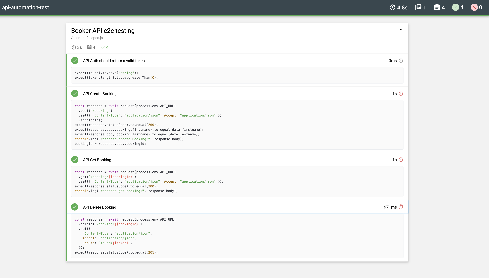

# Booker API Automation Testing

This is a repository of E2E testing for the Booker API using Mocha, Chai, and Supertest.
API Reference: [Booker API](https://restful-booker.herokuapp.com/apidoc/index.html)

## Installation

1. Install Mocha, Chai, and Supertest

```bash
npm install mocha chai supertest
```

2. Install Dotenv

```bash
npm install dotenv
```

3. Install Mochawesome

```bash
npm install mochawesome --save-dev 
```

## Environment Variables

Create a `.env` file in the root directory of the project and add the following variables:

- API_URL
- API_BACKEND_USERNAME
- API_BACKEND_PASSWORD

## Running the tests

```bash
npm test
```

## Documentation


